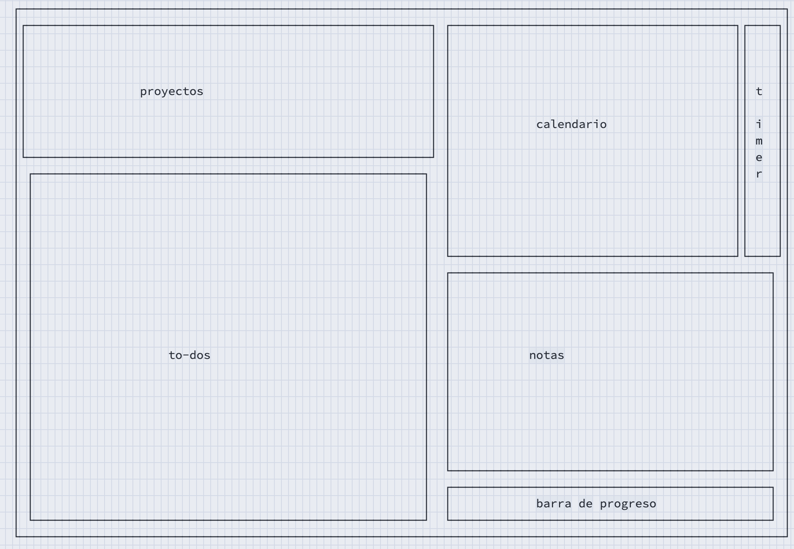

# Slate

**Slate** es un dashboard de productividad en la terminal (TUI), escrito en Rust con
[ratatui](https://ratatui.rs). Reúne en un solo pantallazo tus proyectos, to-dos,
notas, un calendario y temporizadores (pomodoro/cronómetro/reloj).



## Características

- **Proyectos y to-dos** con prioridad, fecha, reordenación y búsqueda/filtro.
- **Subtareas** (checklist) dentro de cada to-do, con barra de progreso.
- **Etiquetas** `#tag`: las escribes en el título y filtras por ellas.
- **Recurrencia** diaria/semanal/mensual: al completar la tarea se regenera.
- **Calendario** con agenda por día y **agenda semanal**, más resaltado de tareas
  vencidas (rojo) y de hoy (ámbar).
- **Notas** por proyecto y notas generales.
- **Pomodoro** foco(25)/break(5), cronómetro y reloj. Registra los focos
  completados, puede **vincularse a un to-do** y avisa al terminar.
- **Vista de pendientes** cruzando todos los proyectos.
- **Estadísticas** con racha de hábitos y mini-gráfico de los últimos 7 días.
- **Deshacer** (`u`) y **papelera** (borrado recuperable).
- **Export/Import** a Markdown y JSON.
- **Configurable**: tema de colores y atajos de teclado vía `config.toml`.

## Instalación

Necesitas [Rust](https://rustup.rs) (incluye `cargo`).

```bash
git clone https://github.com/Shikillo/Slate.git
cd Slate
cargo run --release
```

Para instalarlo como comando del sistema (`slate` desde cualquier sitio):

```bash
cargo install --path .
```

## Atajos principales

| Tecla | Acción |
|-------|--------|
| `Tab` / `Shift+Tab` | Cambiar de panel |
| `↑ ↓` / `j k` | Navegar lista (± semana en calendario) |
| `← →` / `h l` | Mover día en el calendario |
| `a` / `n` | Añadir proyecto o tarea (`#tags` en tareas) |
| `e` | Renombrar / editar notas |
| `d` | Borrar (a la papelera, con confirmación) |
| `u` | Deshacer |
| `Espacio` / `Enter` | Marcar tarea · play relojes · editar notas |
| `f` | Asignar la tarea al día del cursor |
| `p` / `R` | Prioridad · recurrencia |
| `s` | Editar subtareas |
| `m` | Mover la tarea a otro proyecto |
| `v` | Vincular pomodoro a la tarea |
| `/` | Buscar / filtrar (admite `#tag`) |
| `g` | Notas del proyecto ↔ generales |
| `t` / `w` | Agenda de hoy · de la semana |
| `P` | Todas las tareas pendientes |
| `S` | Estadísticas y racha |
| `x` / `o` | Papelera · menú (export/import) |
| `r` / `b` | Reset · foco↔break (relojes) |
| `?` | Ayuda |
| `q` | Salir |

Pulsa `?` dentro de la app para ver la ayuda completa.

## Datos y configuración

Slate guarda su estado en `<config_dir>/slate/store.json`:

- **macOS:** `~/Library/Application Support/slate/`
- **Linux:** `~/.config/slate/`
- **Windows:** `%APPDATA%\slate\`

Para mover tus to-dos entre equipos, usa el menú (`o`) → exportar/importar JSON.

### Personalización

Copia [`config.example.toml`](config.example.toml) a `<config_dir>/slate/config.toml`
para cambiar el **tema de colores** y **reasignar teclas**. Todo es opcional; lo que
no definas usa los valores por defecto.

## Desarrollo

```bash
cargo build      # compilar
cargo test       # tests
cargo run        # ejecutar (modo debug)
```

Estructura:

- `src/main.rs` — event loop (tick de 250 ms).
- `src/app.rs` — estado, foco, modos de entrada, overlays y acciones.
- `src/model.rs` — datos (Project/Todo/Subtask…) y persistencia JSON.
- `src/ui.rs` — renderizado por panel y overlays.
- `src/config.rs` — tema de colores y keymap (`config.toml`).

---

Hecho con 🦀 Rust + ratatui.
